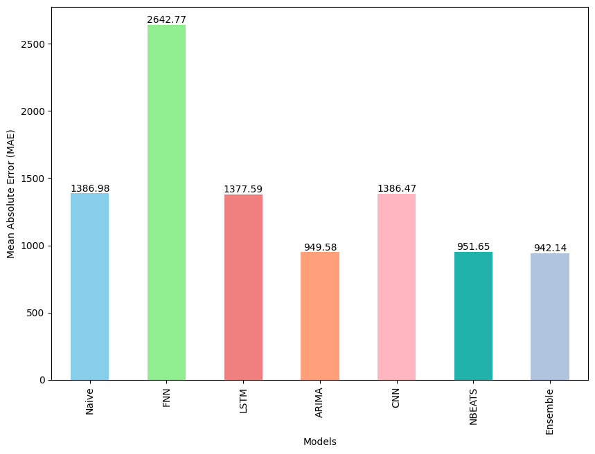

# Bitcoin Time Series Forecasting

This repository contains a comprehensive analysis and forecasting of Bitcoin prices using various machine learning and statistical models. The project includes data preparation, model building, evaluation, and comparison of different forecasting techniques.

## Project Structure

- **Data Preparation**: Loading and preprocessing Bitcoin price data from CSV files.
- **Naive Model**: Implementation and evaluation of a naive forecasting model.
- **Feedforward Neural Network (FNN)**: Building, training, and evaluating a feedforward neural network for time series forecasting.
- **LSTM Model**: Implementation of a Long Short-Term Memory (LSTM) model for sequential data prediction.
- **ARIMA Model**: Building and fitting an ARIMA model with optimal parameters for time series forecasting.
- **CNN Model**: Construction and evaluation of a Convolutional Neural Network (CNN) for forecasting.
- **N-BEATS Algorithm**: Implementation of the N-BEATS algorithm for time series forecasting.
- **Ensemble Learning**: Combining predictions from multiple models to improve forecasting accuracy.
- **Model Comparison**: Evaluating and comparing the performance of different models using metrics such as MAE, RMSE, MAPE, and MASE.

## Results

<table border="1" class="dataframe">

<thead>

<tr style="text-align: right;">

<th></th>

<th>mae</th>

<th>mse</th>

<th>rmse</th>

<th>mape</th>

<th>mase</th>

</tr>

</thead>

<tbody>

<tr>

<th>Naive</th>

<td>1386.977173</td>

<td>3616419.00</td>

<td>1901.688477</td>

<td>2.040159</td>

<td>0.999604</td>

</tr>

<tr>

<th>FNN</th>

<td>2642.769043</td>

<td>12584399.00</td>

<td>3547.449707</td>

<td>3.944340</td>

<td>1.907970</td>

</tr>

<tr>

<th>LSTM</th>

<td>1377.588135</td>

<td>3615433.75</td>

<td>1901.429443</td>

<td>2.026795</td>

<td>7.650260</td>

</tr>

<tr>

<th>ARIMA</th>

<td>949.575195</td>

<td>2158218.50</td>

<td>1469.087646</td>

<td>1.735869</td>

<td>0.993598</td>

</tr>

<tr>

<th>CNN</th>

<td>1386.468262</td>

<td>3633649.75</td>

<td>1906.213501</td>

<td>2.041856</td>

<td>7.655732</td>

</tr>

<tr>

<th>NBEATS</th>

<td>951.653442</td>

<td>2157803.75</td>

<td>1468.946533</td>

<td>1.746844</td>

<td>0.993082</td>

</tr>

<tr>

<th>Ensemble</th>

<td>942.140320</td>

<td>2116802.50</td>

<td>1454.923584</td>

<td>1.724649</td>

<td>0.983155</td>

</tr>

</tbody>

</table>

## Conclusion

Best results showed Ensemble Learning model with the lowest metrics values. ARIMA model and NBEATS algorithm also performed well in terms of forecasting accuracy. NAIVE, LSTM and CNN models showed higher errors compared to other models. And FNN showed the highest errors due to the long prediction horizon.
